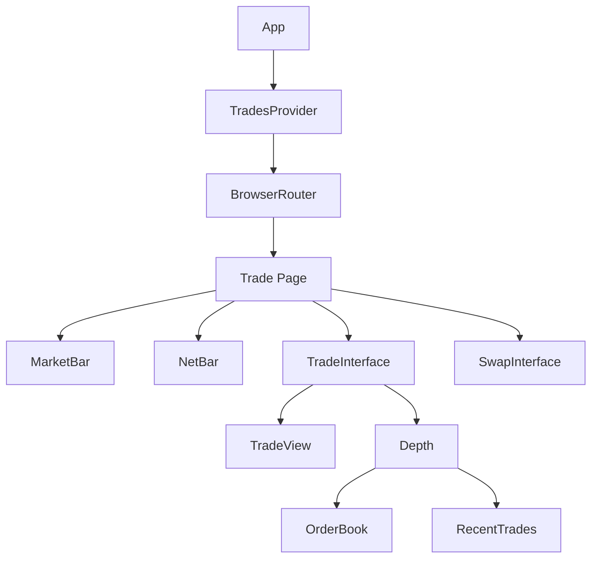
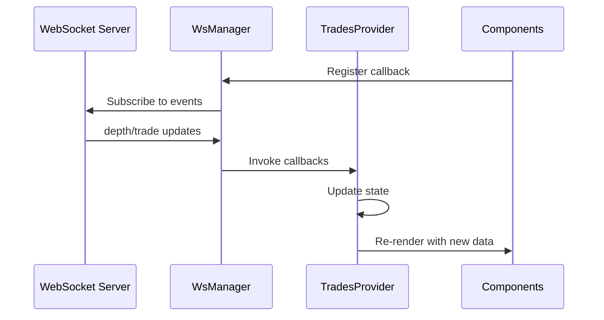

## Introduction

Exchange Web is a modern, real-time crypto trading frontend built with React, TypeScript, and Vite. The application provides a professional trading interface with live order books, price charts, and instant trade execution.

## Monorepo Structure

The project uses a Turborepo monorepo structure with Yarn workspaces:

```
exchange-web/
├── apps/
│   └── web/              # Main trading application
├── packages/
│   ├── ui/               # Shared UI components
│   ├── eslint-config/    # Shared ESLint configuration
│   └── typescript-config/ # Shared TypeScript configuration
└── turbo.json            # Turborepo configuration
```

### Apps Directory

- **web**: The primary trading interface application built with React + Vite

### Packages Directory

- **ui**: Reusable UI components (buttons, cards, etc.)
- **eslint-config**: Shared linting rules
- **typescript-config**: Shared TypeScript compiler settings

## Technology Stack

<CardGroup cols={2}>
  <Card title="React 18" icon="react">
    Modern React with hooks for component logic
  </Card>
  <Card title="TypeScript" icon="code">
    Type-safe development with full type coverage
  </Card>
  <Card title="Vite" icon="bolt">
    Fast build tool and dev server
  </Card>
  <Card title="React Router" icon="route">
    Client-side routing with react-router-dom v6
  </Card>
</CardGroup>

### Key Dependencies

```json
{
  "react": "^18.3.1",
  "react-router-dom": "^6.26.2",
  "lightweight-charts": "^4.2.1",
  "axios": "^1.7.7",
  "sonner": "^1.5.0"
}
```

## Application Structure

```
apps/web/src/
├── components/           # React components
│   ├── SwapInterface.tsx
│   ├── TradeInterface.tsx
│   ├── Depth.tsx
│   ├── MarketBar.tsx
│   ├── NetBar.tsx
│   ├── depth/
│   └── trade_interface/
├── pages/               # Page components
│   └── Trade.tsx
├── state/               # State management
│   └── TradesProvider.tsx
├── utils/               # Utilities
│   ├── ws_manager.ts    # WebSocket manager
│   ├── chart_manager.ts # Chart management
│   ├── requests.ts      # API requests
│   └── types.ts         # TypeScript types
├── App.tsx              # Root component
└── main.tsx             # Application entry
```

## Component Hierarchy

The application follows a clear component hierarchy:



### Root Level

**App.tsx** wraps the entire application with:
- `TradesProvider` for global state
- `BrowserRouter` for routing
- Toast notifications via Sonner
- Vercel Analytics

### Page Level

**Trade.tsx** (apps/web/src/pages/Trade.tsx:32-49) composes the main trading interface:

```tsx
<div className="grid grid-cols-1 lg:grid-cols-[4fr_1fr] gap-2 mt-5 lg:mt-0">
  <div className="order-2 lg:order-1">
    <TradeInterface market={market as string} />
  </div>
  <div className="order-1 lg:order-2">
    <SwapInterface market={market as string} />
  </div>
</div>
```

## Data Flow Architecture

<Steps>
  <Step title="WebSocket Connection">
    WsManager establishes connection to exchange backend
  </Step>
  <Step title="Event Subscription">
    Components subscribe to depth/trade events via callbacks
  </Step>
  <Step title="State Updates">
    WebSocket messages update TradesProvider context state
  </Step>
  <Step title="UI Rendering">
    Components consume context and re-render with new data
  </Step>
</Steps>

### Data Flow Diagram



## Routing

The application uses **react-router-dom v6** for client-side routing:

```tsx
<Routes>
  <Route path="/trade/:market" element={<Trade />} />
  <Route path="*" element={<Navigate to="/trade/SOL_USDC" />} />
</Routes>
```

- Primary route: `/trade/:market` (e.g., `/trade/SOL_USDC`)
- Fallback: Redirects all unknown routes to SOL_USDC market
- Market parameter extracted with `useParams()` hook

## Real-Time Updates

The application is designed for real-time trading with:

<CardGroup cols={2}>
  <Card title="WebSocket Connection" icon="plug">
    Persistent connection to exchange backend
  </Card>
  <Card title="Live Order Book" icon="book">
    Real-time bid/ask updates
  </Card>
  <Card title="Trade Stream" icon="chart-line">
    Instant trade notifications
  </Card>
  <Card title="Price Ticker" icon="dollar-sign">
    Live price and stats updates
  </Card>
</CardGroup>

## Performance Considerations

### Optimization Strategies

- **Singleton Pattern**: WsManager uses singleton to maintain single WebSocket connection
- **Message Buffering**: Messages buffered until connection established
- **Selective Updates**: Components only re-render when relevant state changes
- **Context Optimization**: TradesProvider exposes granular setters to minimize re-renders

## Next Steps

<CardGroup cols={2}>
  <Card title="Components" href="/architecture/components">
    Explore component structure and composition
  </Card>
  <Card title="State Management" href="/architecture/state-management">
    Learn about TradesProvider and context usage
  </Card>
  <Card title="WebSocket" href="/architecture/websocket">
    Understand real-time communication
  </Card>
</CardGroup>