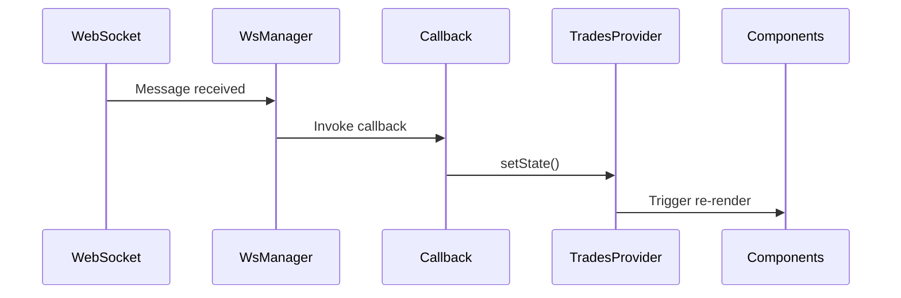

## Overview

Exchange Web uses **React Context API** for global state management through the `TradesProvider`. This centralized approach allows all components to access and update trading data without prop drilling.

## TradesProvider Architecture

The TradesProvider is a context provider that wraps the entire application and manages all trading-related state.

### Provider Hierarchy

From apps/web/src/App.tsx:8-23:

```tsx
function App() {
  return (
    <>
      <TradesProvider>
        <Analytics />
        <Toaster closeButton theme="dark" className="pointer-events-auto" />
        <BrowserRouter>
          <Routes>
            <Route path="/trade/:market" element={<Trade />} />
            <Route path="*" element={<Navigate to="/trade/SOL_USDC" />} />
          </Routes>
        </BrowserRouter>
      </TradesProvider>
    </>
  );
}
```

<Note>
  TradesProvider wraps the entire application, making trading state available to all components via `useContext(TradesContext)`.
</Note>

## State Structure

The TradesContext manages multiple pieces of state related to trading data.

### Context Type Definition

From apps/web/src/state/TradesProvider.tsx:15-34:

```tsx
interface TradesContextType {
  ticker: Ticker | null;
  setTicker: Dispatch<SetStateAction<Ticker | null>>;
  stats: Stat[];
  setStats: Dispatch<SetStateAction<Stat[]>>;
  trades: Trade[];
  setTrades: Dispatch<SetStateAction<Trade[]>>;
  price: string | undefined;
  setPrice: Dispatch<SetStateAction<string | undefined>>;
  // depth
  bids: [string, string][] | undefined;
  asks: [string, string][] | undefined;
  setBids: Dispatch<SetStateAction<[string, string][] | undefined>>;
  setAsks: Dispatch<SetStateAction<[string, string][] | undefined>>;
  totalBidSize: number;
  setTotalBidSize: Dispatch<SetStateAction<number>>;
  totalAskSize: number;
  setTotalAskSize: Dispatch<SetStateAction<number>>;
  orderBookRef: React.MutableRefObject<HTMLDivElement | null>;
}
```

### State Categories

<CardGroup cols={2}>
  <Card title="Price Data" icon="dollar-sign">
    Current price and ticker information
  </Card>
  <Card title="Order Book" icon="book">
    Bids, asks, and total sizes
  </Card>
  <Card title="Trade History" icon="clock">
    Recent trades list
  </Card>
  <Card title="Market Stats" icon="chart-bar">
    24h volume, high, low statistics
  </Card>
</CardGroup>

## Provider Implementation

The full TradesProvider implementation from apps/web/src/state/TradesProvider.tsx:

### State Initialization

From apps/web/src/state/TradesProvider.tsx:56-68:

```tsx
const TradesProvider = ({ children }: TradesProviderProps) => {
  const [ticker, setTicker] = useState<Ticker | null>(null);
  const [stats, setStats] = useState<Stat[]>([]);
  const [trades, setTrades] = useState<Trade[]>([]);
  const [price, setPrice] = useState<string>();

  // depth
  const [bids, setBids] = useState<[string, string][]>(); // [price, quantity]
  const [asks, setAsks] = useState<[string, string][]>(); // [price, quantity]
  const [totalBidSize, setTotalBidSize] = useState<number>(0);
  const [totalAskSize, setTotalAskSize] = useState<number>(0);

  const orderBookRef = useRef<HTMLDivElement>(null);
```

### Context Value

From apps/web/src/state/TradesProvider.tsx:70-96:

```tsx
return (
  <TradesContext.Provider
    value={{
      ticker,
      setTicker,
      stats,
      setStats,
      trades,
      setTrades,
      price,
      setPrice,
      // depth
      bids,
      setBids,
      asks,
      setAsks,
      totalBidSize,
      setTotalBidSize,
      totalAskSize,
      setTotalAskSize,
      orderBookRef,
    }}
  >
    {children}
  </TradesContext.Provider>
);
```

## Consuming Context

Components access state through the `useContext` hook.

### Example: SwapInterface

From apps/web/src/components/SwapInterface.tsx:7-9:

```tsx
export const SwapInterface = ({ market }: { market: string }) => {
  const { price } = useContext(TradesContext);
  const currentPrice = parseFloat(price ?? "0");
  // ...
}
```

### Example: Depth Component

From apps/web/src/components/Depth.tsx:14-22:

```tsx
const {
  setTrades,
  setBids,
  setAsks,
  setPrice,
  setTotalBidSize,
  setTotalAskSize,
  orderBookRef,
} = useContext(TradesContext);
```

### Example: MarketBar

From apps/web/src/components/MarketBar.tsx:6-8:

```tsx
const { ticker, setTicker, stats, setStats, price } =
  useContext(TradesContext);
```

## State Update Patterns

### Direct Updates

Simple state updates for primitive values:

```tsx
setPrice(data.p);
setTotalBidSize(totalBids);
setTotalAskSize(totalAsks);
```

### Functional Updates

Using functional updates for complex state transformations:

From apps/web/src/components/Depth.tsx:31-61:

```tsx
setBids((originalBids) => {
  let bidsAfterUpdate = [...(originalBids || [])];

  // Update existing bids
  for (let i = 0; i < bidsAfterUpdate.length; i++) {
    for (let j = 0; j < data.bids.length; j++) {
      if (bidsAfterUpdate[i][0] === data.bids[j][0]) {
        bidsAfterUpdate[i][1] = data.bids[j][1];
        if (Number(bidsAfterUpdate[i][1]) === 0) {
          bidsAfterUpdate.splice(i, 1);
        }
        break;
      }
    }
  }

  // Add new bids
  for (let j = 0; j < data.bids.length; j++) {
    if (
      Number(data.bids[j][1]) !== 0 &&
      !bidsAfterUpdate.map((x) => x[0]).includes(data.bids[j][0])
    ) {
      bidsAfterUpdate.push(data.bids[j]);
      break;
    }
  }
  
  bidsAfterUpdate.sort((x, y) =>
    Number(y[0]) < Number(x[0]) ? -1 : 1
  );

  bidsAfterUpdate = bidsAfterUpdate.slice(-30);
  return bidsAfterUpdate;
});
```

<Tip>
  Functional updates are crucial when the new state depends on the previous state, ensuring updates are based on the latest state value.
</Tip>

### Trade Updates

From apps/web/src/components/Depth.tsx:115-120:

```tsx
setTrades((oldTrades) => {
  const newTrades = [...oldTrades];
  newTrades.unshift(newTrade);
  newTrades.pop();
  return newTrades;
});
```

This pattern:
1. Creates a copy of existing trades
2. Adds new trade at the beginning
3. Removes oldest trade from the end
4. Maintains fixed-size trade history

## WebSocket Integration

State updates are triggered by WebSocket messages through registered callbacks.

### Flow Diagram



### Callback Registration

Components register callbacks that update context state:

```tsx
WsManager.getInstance().registerCallback(
  "depth",
  (data: any) => {
    setBids(/* update logic */);
    setAsks(/* update logic */);
  },
  `DEPTH-${market}`
);
```

### Trade Event Handling

From apps/web/src/components/Depth.tsx:98-123:

```tsx
WsManager.getInstance().registerCallback(
  "trade",
  (data: any) => {
    console.log("trade has been updated");
    console.log(data);

    const newTrade: Trade = {
      id: data.t,
      isBuyerMaker: data.m,
      price: data.p,
      quantity: data.q,
      quoteQuantity: data.q,
      timestamp: data.T,
    };

    setPrice(data.p);

    setTrades((oldTrades) => {
      const newTrades = [...oldTrades];
      newTrades.unshift(newTrade);
      newTrades.pop();
      return newTrades;
    });
  },
  `TRADE-${market}`
);
```

## Performance Considerations

### Granular Setters

<Check>
  Each piece of state has its own setter, allowing components to update only what they need without causing unnecessary re-renders.
</Check>

### Selective Context Consumption

Components only destructure the context values they need:

```tsx
// Only subscribes to price changes
const { price } = useContext(TradesContext);

// Subscribes to multiple values
const { bids, asks, trades } = useContext(TradesContext);
```

### Ref for DOM Access

The `orderBookRef` provides direct DOM access without re-renders:

```tsx
const orderBookRef = useRef<HTMLDivElement>(null);

if (orderBookRef.current) {
  const halfHeight = orderBookRef.current.scrollHeight / 2;
  orderBookRef.current.scrollTo(0, halfHeight - orderBookRef.current.clientHeight / 2);
}
```

## State Update Flow

<Steps>
  <Step title="WebSocket Message">
    Server sends depth or trade update
  </Step>
  <Step title="Callback Invocation">
    WsManager invokes registered callback with data
  </Step>
  <Step title="State Transformation">
    Callback function transforms data and calls setState
  </Step>
  <Step title="Context Update">
    TradesProvider updates context value
  </Step>
  <Step title="Component Re-render">
    Components consuming updated state re-render
  </Step>
</Steps>

## Best Practices

<AccordionGroup>
  <Accordion title="Use Functional Updates">
    When new state depends on previous state, always use functional updates:
    ```tsx
    setState((prev) => {
      // Transform prev
      return newState;
    });
    ```
  </Accordion>

  <Accordion title="Destructure Selectively">
    Only extract context values you need:
    ```tsx
    const { price, setBids } = useContext(TradesContext);
    ```
  </Accordion>

  <Accordion title="Clean Up Subscriptions">
    Always deregister callbacks in useEffect cleanup:
    ```tsx
    useEffect(() => {
      WsManager.getInstance().registerCallback(...);
      
      return () => {
        WsManager.getInstance().deRegisterCallback(...);
      };
    }, []);
    ```
  </Accordion>

  <Accordion title="Immutable Updates">
    Always create new arrays/objects instead of mutating:
    ```tsx
    const newTrades = [...oldTrades];
    newTrades.unshift(newTrade);
    return newTrades;
    ```
  </Accordion>
</AccordionGroup>

## Next Steps

<CardGroup cols={2}>
  <Card title="Components" href="/architecture/components">
    Learn how components consume context
  </Card>
  <Card title="WebSocket" href="/architecture/websocket">
    Understand WebSocket integration with state
  </Card>
</CardGroup>