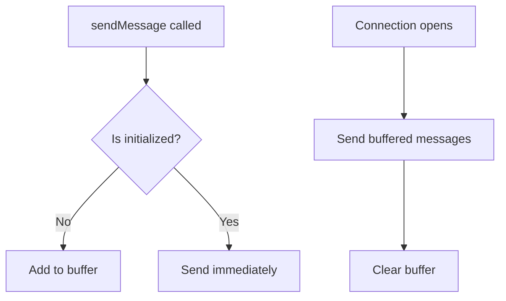
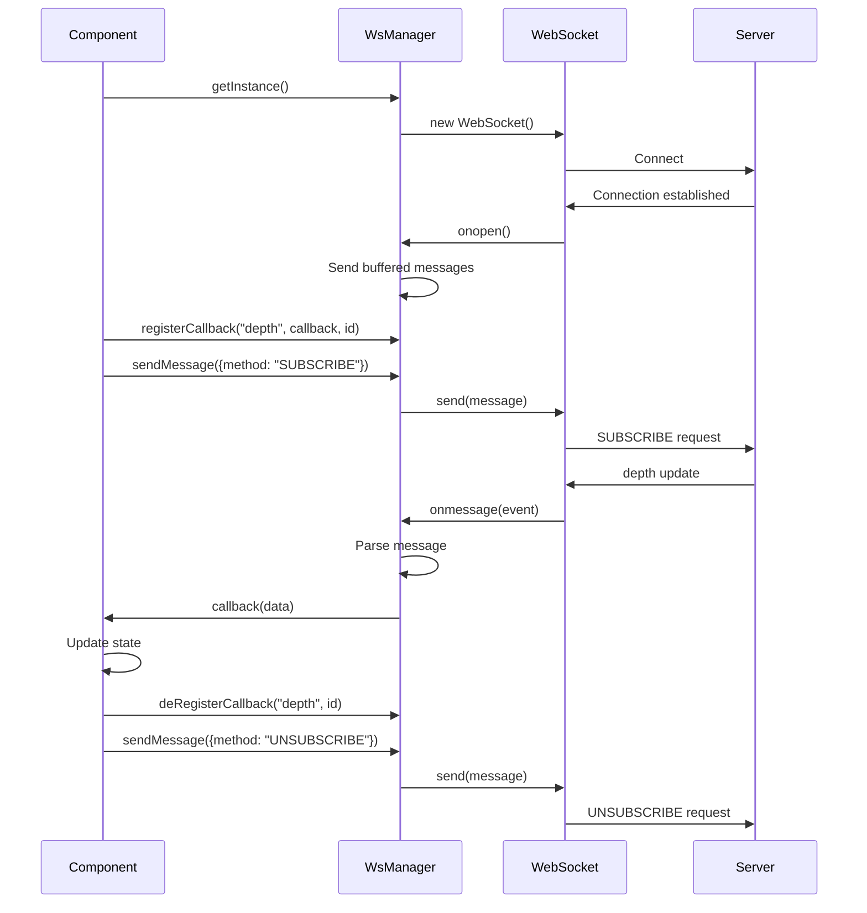

## Overview

Exchange Web uses WebSocket connections for real-time trading data. The `WsManager` class implements a singleton pattern to manage a single persistent WebSocket connection across the entire application.

## WsManager Singleton

The WsManager provides centralized WebSocket management with callback-based message routing.

### Class Structure

From apps/web/src/utils/ws_manager.ts:4-24:

```typescript
export class WsManager {
  private ws: WebSocket;
  private static instance: WsManager;
  private bufferedMessages: any[] = [];
  private callbacks: any = {};
  private id: number;
  private initialized: boolean = false;

  private constructor() {
    this.ws = new WebSocket(BASE_URL);
    this.bufferedMessages = [];
    this.id = 1;
    this.init();
  }

  public static getInstance() {
    if (!this.instance) {
      this.instance = new WsManager();
    }
    return this.instance;
  }
```

<Note>
  The singleton pattern ensures only one WebSocket connection exists, preventing multiple connections and reducing server load.
</Note>

### Connection Configuration

From apps/web/src/utils/ws_manager.ts:1-2:

```typescript
export const BASE_URL = "wss://exchange.jogeshwar.xyz/ws";
```

## Initialization

The WsManager initializes the WebSocket connection and sets up message handling.

### Init Method

From apps/web/src/utils/ws_manager.ts:26-53:

```typescript
init() {
  this.ws.onopen = () => {
    this.initialized = true;
    this.bufferedMessages.forEach((message) => {
      this.ws.send(JSON.stringify(message));
    });
    this.bufferedMessages = [];
  };

  this.ws.onmessage = (event) => {
    const message = JSON.parse(event.data);
    const type = message.data.e;
    if (this.callbacks[type]) {
      this.callbacks[type].forEach(({ callback }: { callback: any }) => {
        if (type === "depth") {
          const updatedBids = message.data.b;
          const updatedAsks = message.data.a;
          callback({ bids: updatedBids, asks: updatedAsks });
        }

        if (type === "trade") {
          const trades = message.data;
          callback(trades);
        }
      });
    }
  };
}
```

### Connection Lifecycle

<Steps>
  <Step title="WebSocket Creation">
    Constructor creates WebSocket connection to exchange server
  </Step>
  <Step title="Open Handler">
    Sets initialized flag and sends buffered messages
  </Step>
  <Step title="Message Handler">
    Routes incoming messages to registered callbacks
  </Step>
</Steps>

## Message Buffering

Messages sent before connection is established are buffered and sent once connected.

### Send Message Method

From apps/web/src/utils/ws_manager.ts:55-65:

```typescript
sendMessage(message: any) {
  const messageToSend = {
    ...message,
    id: this.id++,
  };
  if (!this.initialized) {
    this.bufferedMessages.push(messageToSend);
    return;
  }
  this.ws.send(JSON.stringify(messageToSend));
}
```

<Tip>
  Message buffering ensures no subscription requests are lost during the connection establishment phase.
</Tip>

### Buffering Flow



## Callback System

The callback system allows multiple components to subscribe to WebSocket events.

### Callback Structure

```typescript
callbacks = {
  "depth": [
    { callback: function1, id: "DEPTH-SOL_USDC" },
    { callback: function2, id: "DEPTH-SOL_USDCC" }
  ],
  "trade": [
    { callback: function3, id: "TRADE-SOL_USDC" }
  ]
}
```

### Register Callback

From apps/web/src/utils/ws_manager.ts:67-71:

```typescript
async registerCallback(type: string, callback: any, id: string) {
  this.callbacks[type] = this.callbacks[type] || [];
  this.callbacks[type].push({ callback, id });
  // "ticker" => callback
}
```

### Deregister Callback

From apps/web/src/utils/ws_manager.ts:73-82:

```typescript
async deRegisterCallback(type: string, id: string) {
  if (this.callbacks[type]) {
    const index = this.callbacks[type].findIndex(
      (callback: any) => callback.id === id
    );
    if (index !== -1) {
      this.callbacks[type].splice(index, 1);
    }
  }
}
```

<Warning>
  Always deregister callbacks in component cleanup to prevent memory leaks and duplicate event handling.
</Warning>

## Event Types

The WebSocket server sends two main event types:

<CardGroup cols={2}>
  <Card title="depth" icon="layer-group">
    Order book updates with bids and asks
  </Card>
  <Card title="trade" icon="chart-line">
    New trade executions with price and quantity
  </Card>
</CardGroup>

### Depth Event

Message structure:
```json
{
  "data": {
    "e": "depth",
    "b": [["100.5", "10"], ["100.4", "5"]],
    "a": [["100.6", "8"], ["100.7", "12"]]
  }
}
```

Processing from apps/web/src/utils/ws_manager.ts:40-44:

```typescript
if (type === "depth") {
  const updatedBids = message.data.b;
  const updatedAsks = message.data.a;
  callback({ bids: updatedBids, asks: updatedAsks });
}
```

### Trade Event

Message structure:
```json
{
  "data": {
    "e": "trade",
    "t": 12345,
    "m": false,
    "p": "100.5",
    "q": "1.5",
    "T": 1699564800000
  }
}
```

Processing from apps/web/src/utils/ws_manager.ts:46-49:

```typescript
if (type === "trade") {
  const trades = message.data;
  callback(trades);
}
```

## Subscription Management

Components subscribe and unsubscribe to market data streams.

### Subscribe Example

From apps/web/src/components/Depth.tsx:125-133:

```tsx
WsManager.getInstance().sendMessage({
  method: "SUBSCRIBE",
  params: [`depth.${market}`],
});

WsManager.getInstance().sendMessage({
  method: "SUBSCRIBE",
  params: [`trade.${market}`],
});
```

### Unsubscribe Example

From apps/web/src/components/Depth.tsx:182-191:

```tsx
WsManager.getInstance().sendMessage({
  method: "UNSUBSCRIBE",
  params: [`depth.${market}`],
});

WsManager.getInstance().sendMessage({
  method: "UNSUBSCRIBE",
  params: [`trade.${market}`],
});
```

## Component Integration

Here's a complete example of WebSocket integration in a component.

### Full Integration Pattern

From apps/web/src/components/Depth.tsx:

```tsx
useEffect(() => {
  // Register depth callback
  WsManager.getInstance().registerCallback(
    "depth",
    (data: any) => {
      setBids((originalBids) => {
        // Update bid logic
      });
      setAsks((originalAsks) => {
        // Update ask logic
      });
    },
    `DEPTH-${market}`
  );

  // Register trade callback
  WsManager.getInstance().registerCallback(
    "trade",
    (data: any) => {
      const newTrade: Trade = {
        id: data.t,
        isBuyerMaker: data.m,
        price: data.p,
        quantity: data.q,
        quoteQuantity: data.q,
        timestamp: data.T,
      };

      setPrice(data.p);
      setTrades((oldTrades) => {
        const newTrades = [...oldTrades];
        newTrades.unshift(newTrade);
        newTrades.pop();
        return newTrades;
      });
    },
    `TRADE-${market}`
  );

  // Subscribe to events
  WsManager.getInstance().sendMessage({
    method: "SUBSCRIBE",
    params: [`depth.${market}`],
  });

  WsManager.getInstance().sendMessage({
    method: "SUBSCRIBE",
    params: [`trade.${market}`],
  });

  // Cleanup function
  return () => {
    WsManager.getInstance().deRegisterCallback("depth", `DEPTH-${market}`);
    WsManager.getInstance().sendMessage({
      method: "UNSUBSCRIBE",
      params: [`depth.${market}`],
    });

    WsManager.getInstance().deRegisterCallback("trade", `TRADE-${market}`);
    WsManager.getInstance().sendMessage({
      method: "UNSUBSCRIBE",
      params: [`trade.${market}`],
    });
  };
}, [market]);
```

## Message Flow

### Complete Message Flow Diagram



## Best Practices

<AccordionGroup>
  <Accordion title="Use Unique Callback IDs">
    Always use unique IDs when registering callbacks to enable proper cleanup:
    ```tsx
    const callbackId = `DEPTH-${market}`;
    WsManager.getInstance().registerCallback("depth", callback, callbackId);
    ```
  </Accordion>

  <Accordion title="Clean Up Subscriptions">
    Always deregister callbacks and unsubscribe in useEffect cleanup:
    ```tsx
    useEffect(() => {
      // Register and subscribe
      
      return () => {
        // Deregister and unsubscribe
      };
    }, [market]);
    ```
  </Accordion>

  <Accordion title="Handle Reconnection">
    Consider implementing reconnection logic for production:
    ```typescript
    this.ws.onclose = () => {
      console.log('Connection closed, reconnecting...');
      setTimeout(() => this.reconnect(), 1000);
    };
    ```
  </Accordion>

  <Accordion title="Message Validation">
    Validate message structure before processing:
    ```typescript
    if (message && message.data && message.data.e) {
      const type = message.data.e;
      // Process message
    }
    ```
  </Accordion>
</AccordionGroup>

## Error Handling

Consider adding error handlers for production:

```typescript
this.ws.onerror = (error) => {
  console.error('WebSocket error:', error);
  // Notify user or trigger reconnection
};

this.ws.onclose = (event) => {
  console.log('WebSocket closed:', event.code, event.reason);
  // Implement reconnection strategy
};
```

## Performance Considerations

<CardGroup cols={2}>
  <Card title="Single Connection" icon="plug">
    Singleton pattern ensures one connection for all components
  </Card>
  <Card title="Message Buffering" icon="buffer">
    Prevents message loss during connection phase
  </Card>
  <Card title="Callback Routing" icon="route">
    Efficient message distribution to multiple subscribers
  </Card>
  <Card title="Unique IDs" icon="fingerprint">
    Auto-incrementing message IDs for tracking
  </Card>
</CardGroup>

## Next Steps

<CardGroup cols={2}>
  <Card title="State Management" href="/architecture/state-management">
    Learn how WebSocket data updates application state
  </Card>
  <Card title="Components" href="/architecture/components">
    See how components use WebSocket data
  </Card>
</CardGroup>